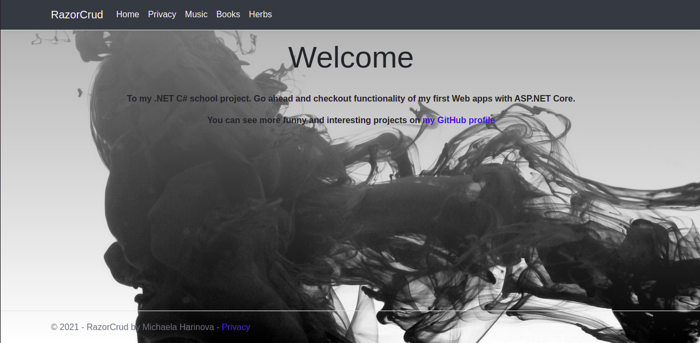
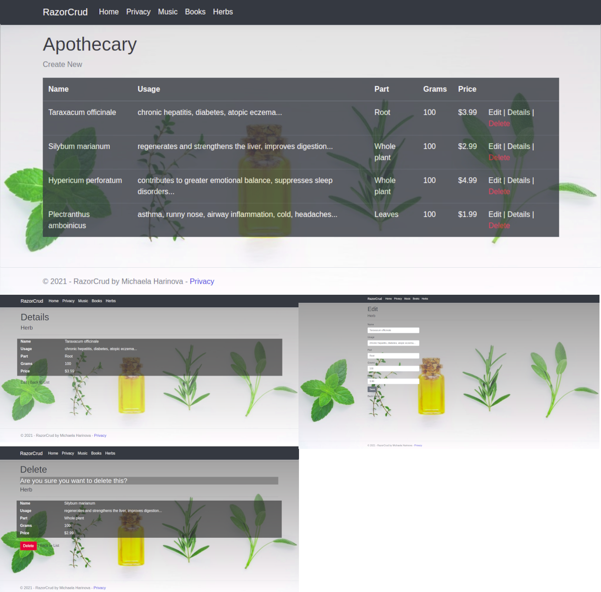
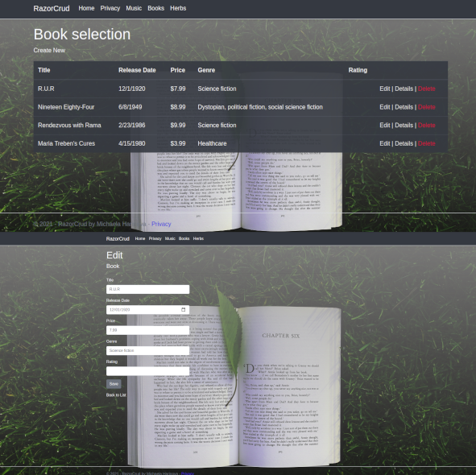
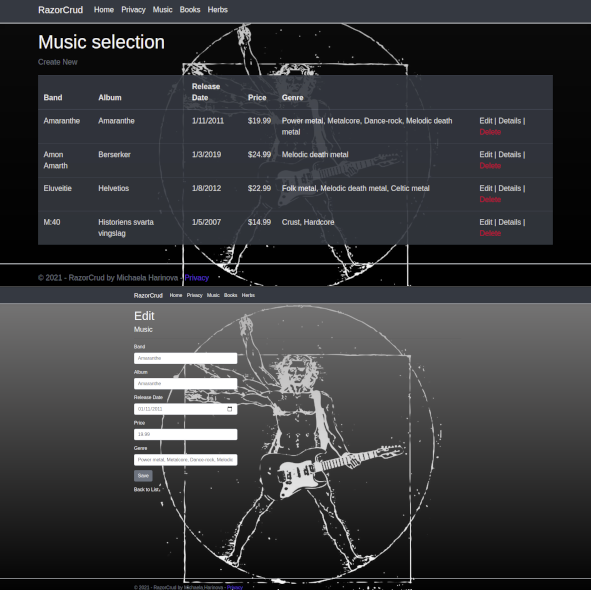

# RazorCrud .NET C#

### A project created by me - a student of BeCode during our training of .NET  with C#.

>[Michaela Harinova](https://github.com/mharin)

#### This project is 4th learning challenge type exercise.
#### We need to learn and improve basic understanding of .NET and C# plus creating database.

## Used technologies:
- .NET
- C#  
- CSS
- Bootstrap  
- HTML

## Learning objectives
> - generating templates and understanding them
> - understanding the model and context
> - understanding sql connection

## The Mission
> - create models     
> - from which we generate database       
> - generate CRUD template        
> - seed SQL
> - show tables with data in a browser

### I did end up with a 3 different types/styles of tables about Music, Books and Herbs

## Interface of RazorCrud webApp
>#### Apothecary pages
>

>#### Some of Books pages
>

>>#### Some of Music pages
>

